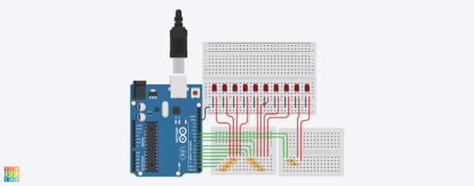
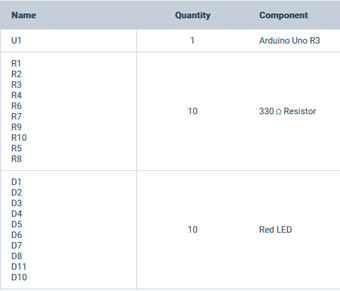

# Efeito-Super-Maquina

Projeto de simulação do efeito super máquina do filme Knight Rider, com um arduino e 10 leds e 10 resistores.

<a href="https://youtu.be/FOOIL2AnH4E">Vídeo de funcionamento</a>

<h2>Explicação do funcionamento:</h2>
 O efeito super máquina é produzido com o funcionamento de um circuito controlado por um Arduino. O sistema é composto por 10 leds e 10 resistores de 330 ohms, cada uma ligado à sua porta referente no Arduino. 
Para que haja o efeito o Arduino manda um sinal para o primeiro led da direita para a esquerda seja aceso por 0,166 segundos, logo em seguida ele manda outro sinal para o primeiro e segundo led, depois para o primeiro, segundo e terceiro led, e continua com o ciclo de acionar 3 leds ao mesmo tempo 8 vezes, depois aciona o último e o penúltimo, e por fim somente o penúltimo. 
Quando ele finaliza a sequência de acender os leds da direita para esquerda, ele começa a sequência contraria, da esquerda para a direita. Cada sequência sendo essa no tempo de 2 segundos, totalizando no total de ida e volta 4 segundos. 
<h2>Ordem de acionamento dos leds da direita para a esquerda:</h2>
<ul>
  <li>D10</li>
  <li>D10, D9</li>
  <li>D10, D9, D8</li>
  <li>D9, D8, D7</li>
  <li>D8, D7, D6</li>
  <li>D7, D6, D5</li>
  <li>D6, D5, D4</li>
  <li>D5, D4, D3</li>
  <li>D4, D3, D2</li>
  <li>D3, D2, D1</li>
  <li>D2, D1</li>
  <li>D1</li>
</ul>

<h2>Ordem de acionamento dos leds da esquerda para a direita:</h2>
<ul>
  <li>D1</li>
  <li>D1, D2</li>
  <li>D1, D2, D3</li>
  <li>D2, D3, D4</li>
  <li>D3, D4, D5</li>
  <li>D4, D5, D6</li>
  <li>D5, D6, D7</li>
  <li>D6, D7, D8</li>
  <li>D7, D8, D9</li>
  <li>D8, D9, D10</li>
  <li>D9, D10</li>
  <li>D10</li>
</ul>

<h2>Hardware:</h2>

 
<h2>Lista de componentes:</h2>

<h2>Código: </h2>

    int leds[11]; //lista para armazenar todas as portas dos leds
    int x = 0, y = 1, z = 2; //variáveis de inicialização da função acendeEsquerdaDireita
    int a = 11, b = 10, c = 9;//variáveis de inicialização da função acendeDireitaEsquerda

    //função para acender somente um led
    void acendeUmLed(int porta)
    {
      digitalWrite(leds[porta], HIGH);
      delay(166.67);
      digitalWrite(leds[porta], LOW);
    }

    //função para acender dois leds
    void acendeDoisLed(int porta1, int porta2)
    {
      digitalWrite(leds[porta1], HIGH);
      digitalWrite(leds[porta2], HIGH);
      delay(166.67);
      digitalWrite(leds[porta1], LOW);
      digitalWrite(leds[porta2], LOW);
    }

    //função para acender três leds
    void acendeTresLed(int porta1, int porta2, int porta3)
    {
      digitalWrite(leds[porta1], HIGH);
      digitalWrite(leds[porta2], HIGH);
      digitalWrite(leds[porta3], HIGH);
      delay(166.67);
      digitalWrite(leds[porta1], LOW);
      digitalWrite(leds[porta2], LOW);
      digitalWrite(leds[porta3], LOW);
    }

    //função para acender todos os leds da direita para a esquerda
    void acendeDireitaEsquerda()
    {
      //acende o primeiro led na porta 10
      acendeUmLed(10);

      //acende os dois leds na porta 10 e 9
      acendeDoisLed(10, 9);

      //acende três leds
      for(int i = 1; i <=8; i++)
      {
        acendeTresLed(a - 1, b - 1, c - 1);
      }

      //acende os dois leds na porta 2 e 1
      acendeDoisLed(2, 1);

      //acende o último led na porta 1
      acendeUmLed(1);
    }

    //função para acender todos os leds da esquerda para a direita
    void acendeEsquerdaDireita()
    {
      //acende o primeiro led na porta 1
      acendeUmLed(1);

      //acende os dois leds na porta 1 e 2
      acendeDoisLed(1, 2);

      //acende três leds
      for(int i = 1; i <=8; i++)
      {
        acendeTresLed(x + 1, y + 1, z + 1);
      }

      //acende os dois leds na porta 9 e 10
      acendeDoisLed(9, 10);

      //acende o último led na porta 10
      acendeUmLed(10);
    }

    void setup()
    {
      //define a porta para cada led na lista
      for(int i = 1; i<=10; i++)
      {
      leds[i] = i;
      }
      //define a saida de cada led na lista
      for(int i = 1; i<=11; i++){
        pinMode(leds[i], OUTPUT);
      }
    }

    void loop()
    {
      //utilizando as funções
      acendeDireitaEsquerda();
      acendeEsquerdaDireita();
    }

